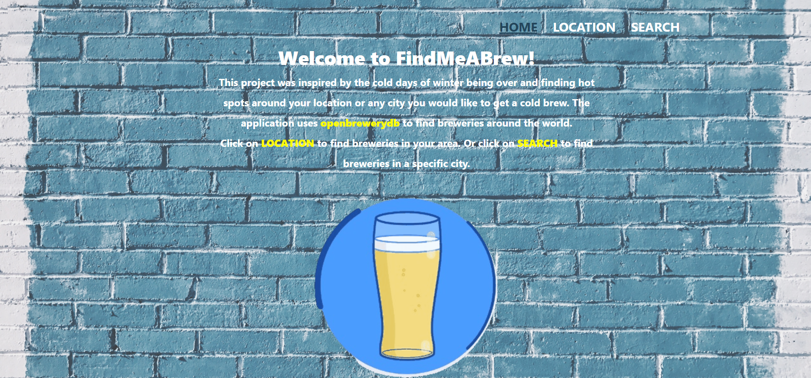
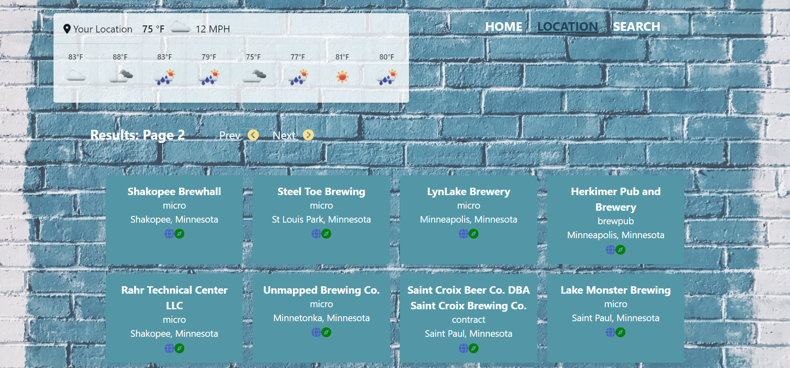
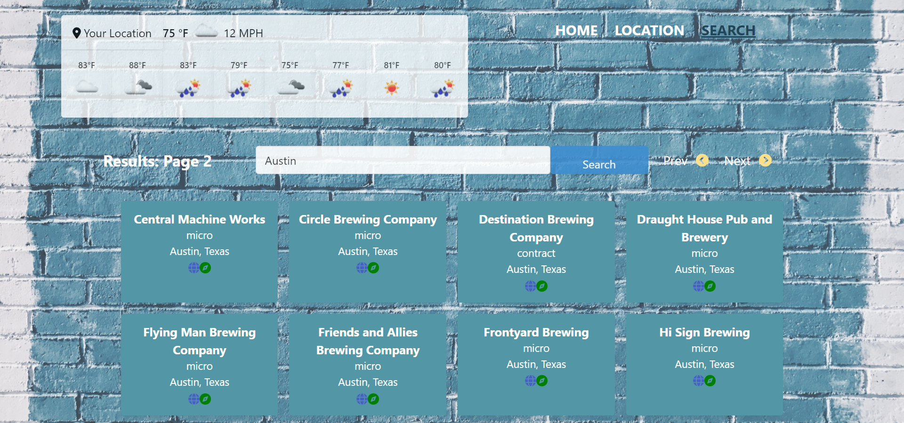

  # React FindMeABrew API

   [](https://opensource.org/licenses/MIT)
  
  ## Table of Contents 

  * [Description](#description)

  * [Screenshots](#screenshots)
  
  * [Installation](#installation)
  
  * [Usage](#usage)
  
  * [Contributing](#contributing)
  
  * [Tests](#tests)

  * [License](#license)

  * [Questions](#questions)

  ## Description

  With spring creeping around the corner, people are excited to get out and do fun things! What else sounds better than having a beer on a sunny day? Our group was able to put our minds together and create a platform to help users search for breweries by "city" entered. The current weather conditions will also be displayed for the search location to help guide users if the weather conditions are favorable to go sit at a patio for a pint, or if they feel like checking out a micro brewery instead!

  The project is using the React framework. Technology packages included are the react-dom-router, bulma components for styling the web application, and fontawesome for some icons. 

  ## Screenshots

  This is the home page with a brief description of the website and how to navigate through.

  

  The location page where the application will find your geolocation and display filter results by distance.

  

  The search page is where users can find breweries by city name's and see all the breweries that city has to offer.

  
  
  ## Installation 

  To install the necessary dependencies, run the following command:
  
  ```Dependencies
   npm i
  ```  
  ## Usage

  The API data used for this project was supplied by openbrewerydb and openweathermap. No need for a key for the openbrewerydb but will need an api key for the openweathermap.
  
  ## Contributing

  Please contact me via email if you would like to contribute to this project. There can be some more implementation to the backend.
  
  ## Tests
  
  To run a test, run the following command: 

  ```tests
   npm run test
  ```
  ## License

  This project is licensed under the MIT license 

  ## Questions
  
  If you have any questions about the repo, open an issue contact me directly at [midthun23@gmail.com](mailto:midthun23@gmail.com). You can find more work at [midth002](https://github.com/midth002)
  
